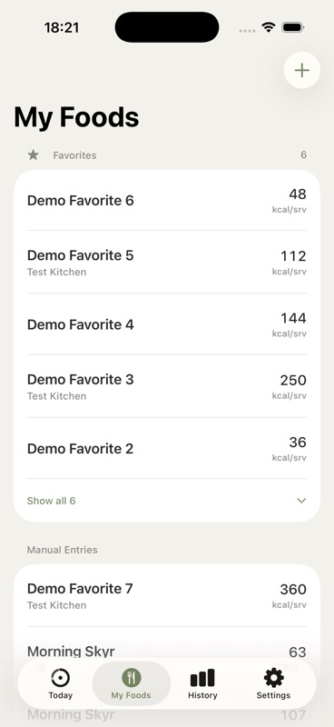
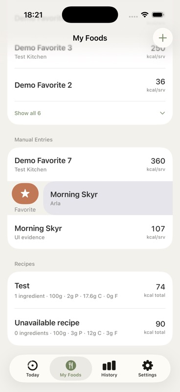
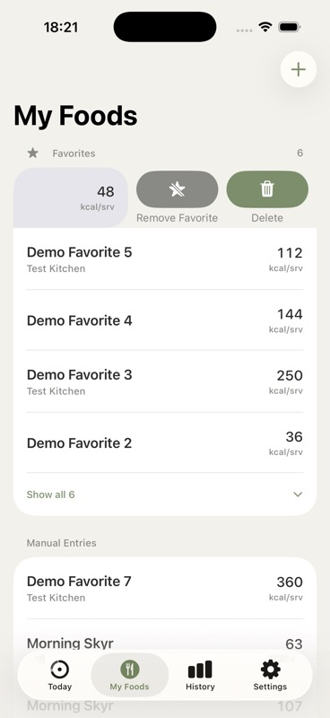
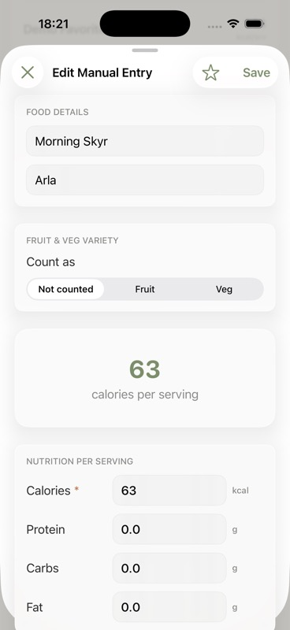
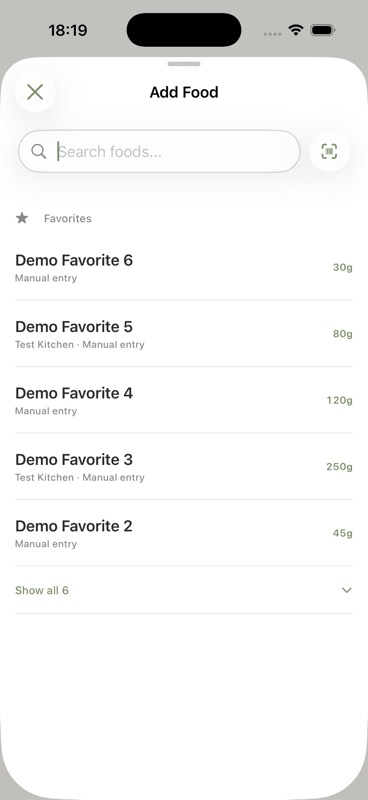
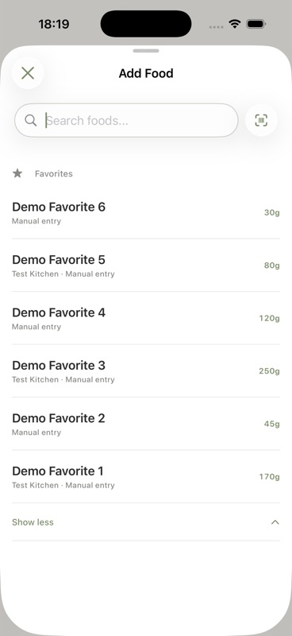

# Issue #69 UI evidence

Captured on an iPhone 17 Pro simulator running iOS 26.4.

| State | Evidence |
| --- | --- |
| My Foods keeps Favorites at the top, hides duplicate rows, and limits the collapsed section to five |  |
| A leading swipe on an eligible custom food exposes Favorite |  |
| A trailing swipe on a favorite exposes Remove Favorite beside Delete |  |
| An existing custom food can be favorited from the edit toolbar beside Save |  |
| Quick logging shows five compact favorites, remembered amounts, and no redundant destination label |  |
| Show all expands large favorite collections and Show less collapses them again |  |

The no-history path reuses the app's standard portion input sheet. The logged-food
editor deliberately has no favorite control because favorites belong to custom food
definitions, not individual log entries.
