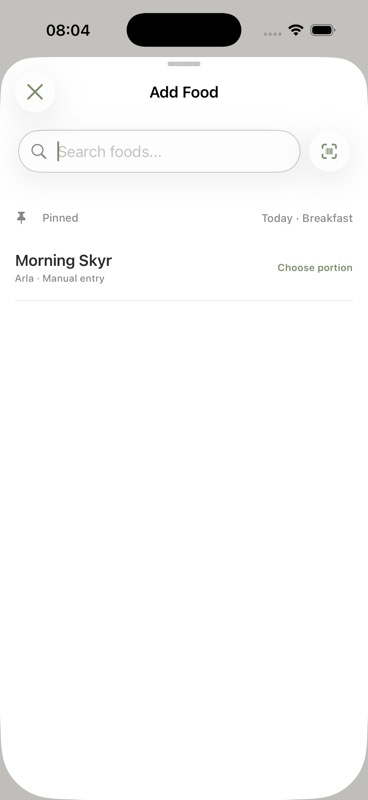
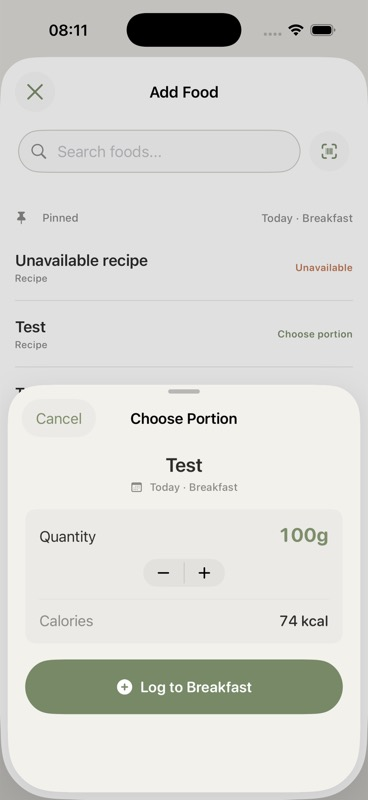
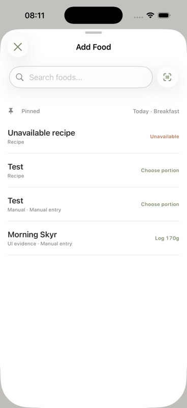
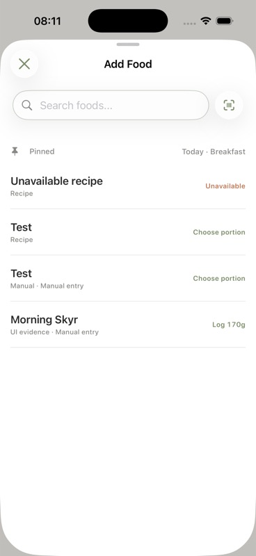
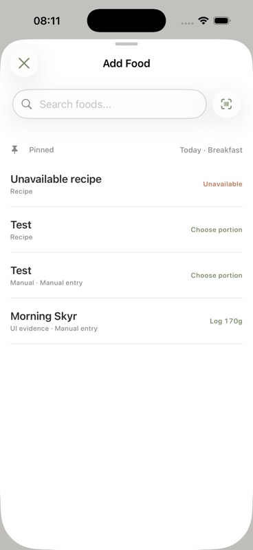
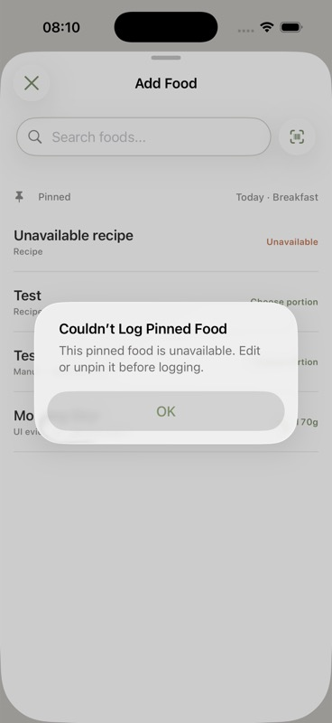

# Issue #69 UI evidence

Captured on an iPhone 17 Pro simulator running iOS 26.4.

| State | Evidence |
| --- | --- |
| Absent Pinned and Recent sections stay hidden |  |
| Simplified pinned row without a reusable portion |  |
| Compact quantity confirmation with explicit destination |  |
| One-tap last-portion action with explicit meal and date |  |
| Duplicate names remain distinct and show different action states |  |
| Unavailable pinned food is retained and clearly labeled |  |
| Unavailable action explains how to recover |  |
